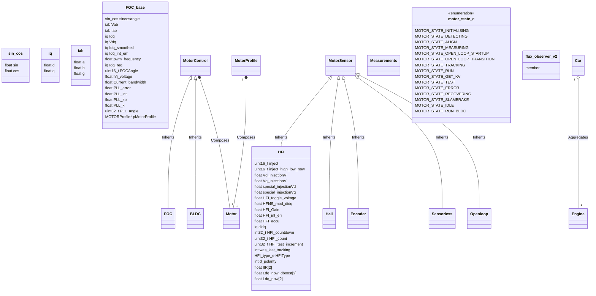

```mermaid
classDiagram

class sin_cos {
	float sin
	float cos
}

class iq {
  float d
  float q
}

class iab {
  float a
  float b
  float g
}

class HFI {
  uint16_t inject
  uint16_t inject_high_low_now
  float Vd_injectionV
  float Vq_injectionV
  float special_injectionVd
  float special_injectionVq
  float HFI_toggle_voltage
  float HFI45_mod_didq
  float HFI_Gain
  float HFI_int_err
  float HFI_accu
  iq didq
  int32_t HFI_countdown
  uint32_t HFI_count
  uint32_t HFI_test_increment
  int was_last_tracking
  HFI_type_e HFIType
  int d_polarity
  float IIR[2]
  float Ldq_now_dboost[2]
  float Ldq_now[2]
}


class FOC_base{

  sin_cos sincosangle
  iab Vab
  iab Iab
  iq Idq
  iq Vdq
  iq Idq_smoothed
  iq Idq_int_err
  float pwm_frequency
  iq Idq_req
  uint16_t FOCAngle
  float hfi_voltage
  float Current_bandwidth
  float PLL_error
  float PLL_int
  float PLL_kp
  float PLL_ki
  uint32_t PLL_angle
  MOTORProfile* pMotorProfile
}

MotorControl <|-- FOC : Inherits
MotorControl <|-- BLDC : Inherits

MotorSensor <|-- HFI : Inherits
MotorSensor <|-- Hall : Inherits
MotorSensor <|-- Encoder : Inherits
MotorSensor <|-- Sensorless : Inherits
MotorSensor <|-- Openloop : Inherits

MotorProfile "1" *-- "1" Motor : Composes
MotorControl "1" *-- "1" Motor : Composes

class Measurements

class motor_state_e {
    <<enumeration>>
  MOTOR_STATE_INITIALISING
  MOTOR_STATE_DETECTING
  MOTOR_STATE_ALIGN
  MOTOR_STATE_MEASURING
  MOTOR_STATE_OPEN_LOOP_STARTUP
  MOTOR_STATE_OPEN_LOOP_TRANSITION
  MOTOR_STATE_TRACKING
  MOTOR_STATE_RUN
  MOTOR_STATE_GET_KV
  MOTOR_STATE_TEST
  MOTOR_STATE_ERROR
  MOTOR_STATE_RECOVERING
  MOTOR_STATE_SLAMBRAKE
  MOTOR_STATE_IDLE
  MOTOR_STATE_RUN_BLDC
}

class flux_observer_v2 {
  member
}
Car "1" o-- "1" Engine : Aggregates
```
